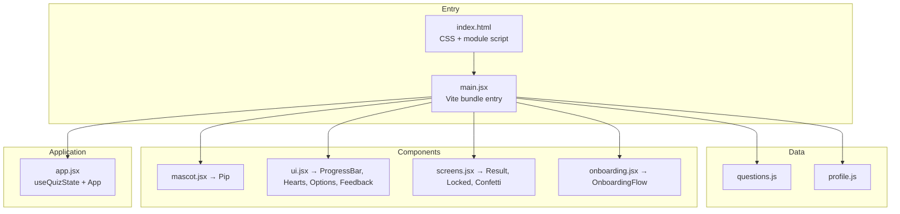

# Parla

**Learn Spanish through a Duolingo-style unit path, quiz loop, hearts economy, and premium recovery model.**

Parla is a mobile-first language learning prototype inspired by the strongest product patterns in modern learning apps: a unit map, persistent hearts, streaks, gems, XP, instant feedback, premium upsells, and a mascot that reacts to learner state. The app is built with **React 19** and **Vite** — JSX is precompiled at build time for local dev and production deploys.

[](https://react.dev/)
[](https://vite.dev/)
[](LICENSE)
[](package.json)

---

## Table of contents

- [Overview](#overview)
- [Features](#features)
- [Quick start](#quick-start)
- [Architecture](#architecture)
- [Project structure](#project-structure)
- [Configuration](#configuration)
- [Adding questions](#adding-questions)
- [Design system](#design-system)
- [Browser support](#browser-support)
- [Roadmap](#roadmap)
- [Contributing](#contributing)
- [License](#license)

---

## Overview

Parla turns vocabulary and translation drills into a short, focused lesson. The learner starts from a unit path, spends hearts on mistakes, earns XP/gems/streak progress on completion, and hits a recovery decision when hearts run out: wait, practice, spend gems, or try Parla+.

Source modules are bundled with Vite (`main.jsx` entry). React and JSX compile at build time — there is no in-browser Babel or CDN React runtime in production.

For the ruthless product and engineering teardown, see [`DUOLINGO_CLONE_AUDIT.md`](DUOLINGO_CLONE_AUDIT.md).

**Who it's for**

| Audience | Use case |
|----------|----------|
| Learners | Quick Spanish practice on phone or desktop |
| Designers | Reference for playful, high-polish mobile UI |
| Developers | Lightweight React app with a minimal Vite toolchain |

---

## Features

### Core loop

- **Unit path** — a home map with lesson nodes, locked future content, and account stats
- **10-question lessons** — vocabulary and translation prompts with answer explanations
- **Persistent hearts system** — 5 account hearts; incorrect answers deduct one heart
- **Instant feedback** — slide-up bar with correct answer reveal on mistakes
- **Progress tracking** — animated progress bar, XP, gems, streak, and completed lessons

### Delight & retention

- **Pip, the mascot** — SVG character with mood states: idle, thinking, happy, sad
- **Speech bubble** — contextual encouragement for normal, low-heart, correct, and wrong states
- **Results screen** — star rating (1–3), XP, gems, confetti, and path continuation
- **Locked screen** — heart refill countdown, practice recovery, gem refill, and Parla+ upsell

### Engineering quality

- **Vite bundle** — `main.jsx` imports modules in a fixed order; components still register on `window` for the current bridge pattern
- **Account economy hook** — `useAccount` centralizes hearts, gems, XP, streaks, Plus, and refill timing
- **Quiz state hook** — `useQuizState` centralizes selection, scoring, feedback, lock, and completion phases
- **Source smoke test** — `npm run test` validates lesson schema, profile spine, and core invariants
- **Acceptance suite** — `npm run acceptance` runs Playwright checks against a running preview server
- **Accessibility** — ARIA on progress bar, reduced-motion media query, semantic buttons
- **Mobile-first** — phone-frame layout, safe-area insets, `100dvh` viewport handling

---

## Quick start

### Prerequisites

- **Node.js 22.12+** (see `engines` in `package.json`; use `nvm use` if you have `.nvmrc`)
- A modern browser (Chrome, Safari, Firefox, Edge)

### Run locally

```bash
# Clone the repository
git clone https://github.com/Nicolercc/Parla.git
cd Parla

# Match Node version (optional, if using nvm)
nvm use

# Install dependencies
npm install

# Dev server (Vite, hot reload)
npm run dev

# Production bundle smoke test
npm run build && npm run preview
```

Then visit **http://localhost:5173** for `npm run dev`, or **http://localhost:4173** after `npm run preview`.

### Tests

```bash
# Source invariants (lessons, profile spine, voice/mascot guards)
npm run test

# Production build
npm run build

# End-to-end acceptance (requires preview server on port 3456)
npm run build && npx vite preview --port 3456 --host 127.0.0.1
PARLA_URL=http://127.0.0.1:3456 npm run acceptance
```

Vite precompiles JSX for local dev and Vercel production output in `dist/`.

---

## Architecture

Vite bundles ES modules from `main.jsx`. Each source file still attaches exports to `window` for compatibility with the existing flat-module layout. React mounts a single root in `app.jsx`.



### State machine

The quiz moves through three phases managed by `useQuizState`:

| Phase | Trigger | Screen |
|-------|---------|--------|
| `quiz` | Default | Question flow with hearts and progress |
| `locked` | Hearts reach 0 | Refill timer + upsell + restart |
| `complete` | Last question answered | Stars, score, XP, practice again |

Within `quiz`, each question follows: **select → check → feedback → advance**.

---

## Project structure

```
Parla/
├── index.html          # Shell, global CSS, Vite module entry
├── main.jsx            # Vite bundle entry (import order)
├── vite.config.js      # Vite + React plugin
├── app.jsx             # Root component, CONFIG, useQuizState hook
├── onboarding.jsx      # 7-step onboarding + plan summary
├── profile.js          # Account metadata, plan copy, personalization
├── ui.jsx              # Reusable UI: hearts, progress, options, feedback
├── screens.jsx         # End states: results, locked, confetti, stars
├── mascot.jsx          # Pip SVG mascot with mood animations
├── questions.js        # Question bank (window.PARLA_QUESTIONS)
├── scripts/
│   ├── check-source.mjs   # npm run test
│   └── acceptance.mjs     # npm run acceptance
├── package.json
└── README.md
```

### Module responsibilities

| File | Exports | Responsibility |
|------|---------|----------------|
| `questions.js` | `window.PARLA_QUESTIONS` | Static question data |
| `profile.js` | `window.PARLA_META`, account helpers | Onboarding metadata, plan summary, home copy |
| `mascot.jsx` | `window.Pip`, `window.Mascot` | Animated SVG mascot |
| `ui.jsx` | `Heart`, `ProgressBar`, `HeartsDisplay`, `OptionButton`, `QuestionCard`, `FeedbackBar`, `ActionButton` | Shared interactive UI |
| `screens.jsx` | `ResultScreen`, `LockedScreen`, `Confetti`, `Star` | Terminal and monetization screens |
| `onboarding.jsx` | `window.OnboardingFlow` | Onboarding flow |
| `app.jsx` | — (mounts `<App />`) | Orchestration, config, quiz state |

---

## Configuration

Tune behavior in the `CONFIG` object at the top of `app.jsx`:

```javascript
const CONFIG = {
  maxHearts: 3,           // Lives per lesson
  showMascot: true,       // Toggle Pip and speech bubble
  optionColumns: 2,       // Grid columns for answer choices
  accent: {
    c: '#3DDC84',         // Primary green (--green)
    d: '#22B567',         // Dark green (--green-d)
  },
};
```

CSS custom properties in `index.html` control the full palette (`--blue`, `--coral`, `--purple`, etc.) and can be overridden via the root `style` on `.app`.

---

## Adding questions

Questions live in `questions.js` as an array on `window.PARLA_QUESTIONS`. Each item follows this schema:

```javascript
{
  id: 11,
  prompt: 'book',                    // Word or phrase shown to the learner
  hint: 'How do you say',            // Uppercase label above the prompt
  options: ['libro', 'mesa', 'silla', 'puerta'],
  correctIndex: 0,                   // Zero-based index into options
}
```

**Hints in use today:** `How do you say` (English → Spanish) and `Translate` (phrase translation).

With `npm run dev`, changes hot-reload. For production, run `npm run build` before deploy.

---

## Design system

Parla uses a warm, playful aesthetic tuned for learning apps.

| Token | Value | Usage |
|-------|-------|-------|
| `--green` | `#3DDC84` | Primary actions, progress, mascot |
| `--coral` | `#FF5A7A` | Errors, wrong answers, hearts |
| `--blue` | `#38BDF8` | Selected options |
| `--yellow` | `#FFD23C` | Stars, Parla+ accents |
| `--ink` | `#2B2A4A` | Body text |
| `--bg` | `#FBF7EF` | Phone screen background |

**Typography:** [Fredoka](https://fonts.google.com/specimen/Fredoka) for display headings, [Nunito](https://fonts.google.com/specimen/Nunito) for UI copy.

**Motion:** Bobbing mascot, heart-break animation, confetti on completion. Respects `prefers-reduced-motion`.

**Layout:** Centered phone frame (max 430×880px) with rounded corners and shadow on viewports ≥ 480px.

---

## Browser support

| Browser | Support |
|---------|---------|
| Chrome / Edge 90+ | Full |
| Safari 15+ | Full |
| Firefox 90+ | Full |

Requires a modern browser. JSX is precompiled with Vite at build time — do not ship raw `.jsx` through in-browser Babel in production.

---

## Roadmap

- [ ] Spaced repetition and question pools by topic
- [ ] Audio pronunciation for prompts and answers
- [ ] Keyboard shortcuts (A–D to select, Enter to check)
- [ ] i18n — support additional target languages

---

## Contributing

Contributions are welcome. For meaningful changes:

1. Fork the repo and create a feature branch
2. Use Node 22.12+ (`nvm use` if applicable)
3. Run `npm run test` and `npm run build` before opening a PR
4. Match existing naming, CSS token usage, and component APIs
5. Test in mobile viewport (375px) and desktop
6. Open a PR with a clear description and screenshots for UI changes

**Good first issues:** new questions, accessibility improvements, reduced-motion polish.

---

## License

ISC — see [package.json](package.json).

---

<p align="center">
  <strong>Parla</strong> — practice a little, every day. 🌱
</p>
