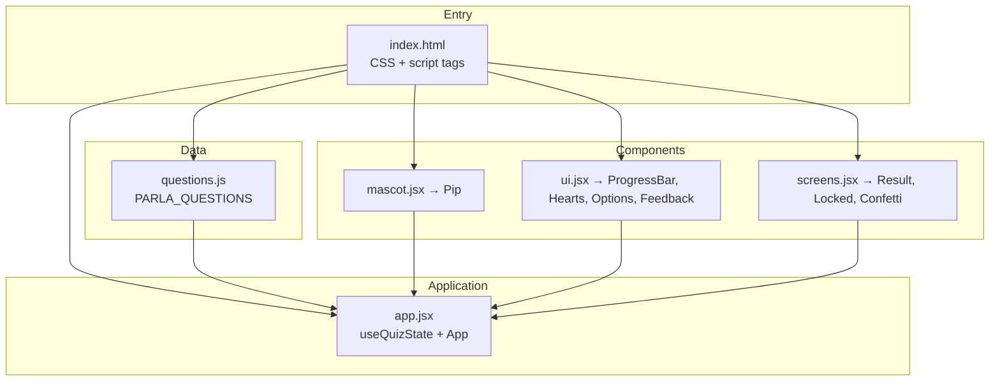

# Parla

**Learn Spanish through bite-sized, game-like practice — no install, no build step.**

Parla is a mobile-first language quiz inspired by the best patterns in modern learning apps: hearts, streaks, instant feedback, and a mascot that reacts to every answer. It runs entirely in the browser with React 18 and zero bundler configuration.

[](https://react.dev/)
[](LICENSE)
[](package.json)

---

## Table of contents

- [Overview](#overview)
- [Features](#features)
- [Quick start](#quick-start)
- [Architecture](#architecture)
- [Project structure](#project-structure)
- [Configuration](#configuration)
- [Adding questions](#adding-questions)
- [Design system](#design-system)
- [Browser support](#browser-support)
- [Roadmap](#roadmap)
- [Contributing](#contributing)
- [License](#license)

---

## Overview

Parla turns vocabulary and translation drills into a short, focused lesson. Each session walks the learner through 10 multiple-choice questions while tracking progress, lives, and XP. Wrong answers cost a heart; run out and the lesson locks until hearts refill — or the learner starts fresh.

The app is deliberately simple to run and extend: open a file, edit questions in plain JavaScript, refresh. No Webpack, no Vite, no transpile pipeline. JSX is compiled in the browser via Babel Standalone, and React loads from a CDN.

**Who it's for**

| Audience | Use case |
|----------|----------|
| Learners | Quick Spanish practice on phone or desktop |
| Designers | Reference for playful, high-polish mobile UI |
| Developers | Lightweight React patterns without a build toolchain |

---

## Features

### Core loop

- **10-question lessons** — vocabulary (`How do you say…`) and translation (`Translate`) prompts
- **Hearts system** — 3 lives per round; incorrect answers deduct one heart
- **Instant feedback** — slide-up bar with correct answer reveal on mistakes
- **Progress tracking** — animated progress bar and per-question transitions

### Delight & retention

- **Pip, the mascot** — SVG character with mood states: idle, thinking, happy, sad
- **Speech bubble** — contextual Spanish encouragement (`¿Cómo se dice…?`, `¡Sí! Perfecto.`)
- **Results screen** — star rating (1–3), XP earned, confetti on completion
- **Locked screen** — heart refill countdown, Parla+ upsell card, restart option

### Engineering quality

- **Modular IIFE modules** — each file attaches to `window`; no import graph to configure
- **Custom hook** — `useQuizState` centralizes quiz logic (selection, scoring, phase transitions)
- **Accessibility** — ARIA on progress bar, reduced-motion media query, semantic buttons
- **Mobile-first** — phone-frame layout, safe-area insets, `100dvh` viewport handling

---

## Quick start

### Prerequisites

- A modern browser (Chrome, Safari, Firefox, Edge)
- Any static file server (optional but recommended for local development)

### Run locally

```bash
# Clone the repository
git clone https://github.com/Nicolercc/Parla.git
cd Parla

# Option A — Python (built into macOS/Linux)
python3 -m http.server 8080

# Option B — Node (npx, no install)
npx serve .

# Option C — open directly (works; a server is nicer for dev)
open index.html
```

Then visit **http://localhost:8080** (or the port your server prints).

No `npm install` required. The app loads React, ReactDOM, and Babel from CDN.

---

## Architecture

Parla uses a flat module pattern: plain scripts load in order, each registering components on `window`. React renders a single root in `app.jsx`.



### State machine

The quiz moves through three phases managed by `useQuizState`:

| Phase | Trigger | Screen |
|-------|---------|--------|
| `quiz` | Default | Question flow with hearts and progress |
| `locked` | Hearts reach 0 | Refill timer + upsell + restart |
| `complete` | Last question answered | Stars, score, XP, practice again |

Within `quiz`, each question follows: **select → check → feedback → advance**.

---

## Project structure

```
Parla/
├── index.html      # Entry point, global CSS, CDN scripts, load order
├── app.jsx         # Root component, CONFIG, useQuizState hook
├── ui.jsx          # Reusable UI: hearts, progress, options, feedback
├── screens.jsx     # End states: results, locked, confetti, stars
├── mascot.jsx      # Pip SVG mascot with mood animations
├── questions.js    # Question bank (window.PARLA_QUESTIONS)
├── package.json    # Project metadata (no runtime dependencies)
└── README.md
```

### Module responsibilities

| File | Exports | Responsibility |
|------|---------|----------------|
| `questions.js` | `window.PARLA_QUESTIONS` | Static question data |
| `mascot.jsx` | `window.Pip` | Animated SVG mascot |
| `ui.jsx` | `Heart`, `ProgressBar`, `HeartsDisplay`, `OptionButton`, `QuestionCard`, `FeedbackBar`, `ActionButton` | Shared interactive UI |
| `screens.jsx` | `ResultScreen`, `LockedScreen`, `Confetti`, `Star` | Terminal and monetization screens |
| `app.jsx` | — (mounts `<App />`) | Orchestration, config, quiz state |

---

## Configuration

Tune behavior in the `CONFIG` object at the top of `app.jsx`:

```javascript
const CONFIG = {
  maxHearts: 3,           // Lives per lesson
  showMascot: true,       // Toggle Pip and speech bubble
  optionColumns: 2,       // Grid columns for answer choices
  accent: {
    c: '#3DDC84',         // Primary green (--green)
    d: '#22B567',         // Dark green (--green-d)
  },
};
```

CSS custom properties in `index.html` control the full palette (`--blue`, `--coral`, `--purple`, etc.) and can be overridden via the root `style` on `.app`.

---

## Adding questions

Questions live in `questions.js` as an array on `window.PARLA_QUESTIONS`. Each item follows this schema:

```javascript
{
  id: 11,
  prompt: 'book',                    // Word or phrase shown to the learner
  hint: 'How do you say',            // Uppercase label above the prompt
  options: ['libro', 'mesa', 'silla', 'puerta'],
  correctIndex: 0,                   // Zero-based index into options
}
```

**Hints in use today:** `How do you say` (English → Spanish) and `Translate` (phrase translation).

After editing, refresh the browser. No rebuild step.

---

## Design system

Parla uses a warm, playful aesthetic tuned for learning apps.

| Token | Value | Usage |
|-------|-------|-------|
| `--green` | `#3DDC84` | Primary actions, progress, mascot |
| `--coral` | `#FF5A7A` | Errors, wrong answers, hearts |
| `--blue` | `#38BDF8` | Selected options |
| `--yellow` | `#FFD23C` | Stars, Parla+ accents |
| `--ink` | `#2B2A4A` | Body text |
| `--bg` | `#FBF7EF` | Phone screen background |

**Typography:** [Fredoka](https://fonts.google.com/specimen/Fredoka) for display headings, [Nunito](https://fonts.google.com/specimen/Nunito) for UI copy.

**Motion:** Bobbing mascot, heart-break animation, confetti on completion. Respects `prefers-reduced-motion`.

**Layout:** Centered phone frame (max 430×880px) with rounded corners and shadow on viewports ≥ 480px.

---

## Browser support

| Browser | Support |
|---------|---------|
| Chrome / Edge 90+ | Full |
| Safari 15+ | Full |
| Firefox 90+ | Full |

Requires JavaScript and ES6+. JSX is transpiled at runtime by Babel Standalone — fine for demos and prototypes; a production deployment would typically precompile assets.

---

## Roadmap

- [ ] Spaced repetition and question pools by topic
- [ ] Local persistence (hearts refill timestamp, streak, XP)
- [ ] Audio pronunciation for prompts and answers
- [ ] Keyboard shortcuts (A–D to select, Enter to check)
- [ ] Build pipeline option (Vite) for production bundles
- [ ] i18n — support additional target languages

---

## Contributing

Contributions are welcome. For meaningful changes:

1. Fork the repo and create a feature branch
2. Keep modules in the existing IIFE + `window` export pattern
3. Match existing naming, CSS token usage, and component APIs
4. Test in mobile viewport (375px) and desktop
5. Open a PR with a clear description and screenshots for UI changes

**Good first issues:** new questions, mascot moods, accessibility improvements, reduced-motion polish.

---

## License

ISC — see [package.json](package.json).

---

<p align="center">
  <strong>Parla</strong> — practice a little, every day. 🌱
</p>
